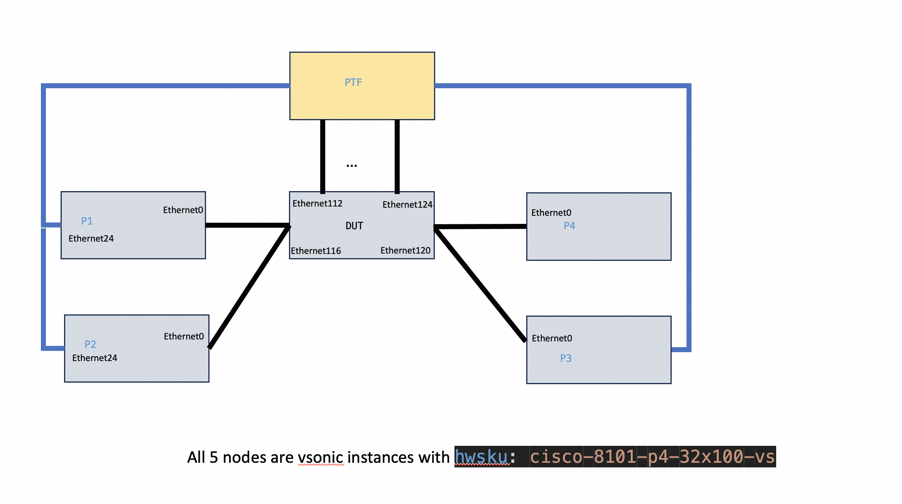
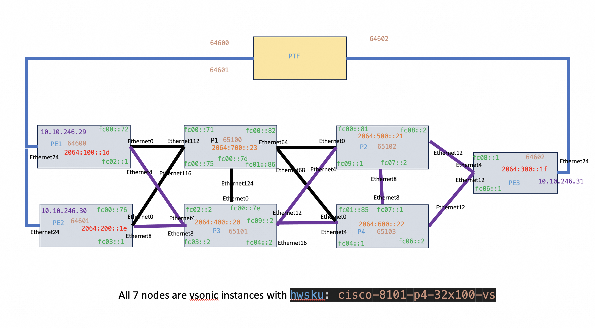

<!-- omit in toc -->
# SRv6 PhoenixWing PTF Test Plan
<!-- omit in toc -->
### Revision
| Rev |     Date    |           Author           | Change Description                |
|:---:|:-----------:|:--------------------------:|-----------------------------------|
| 0.1 | July 2024   | Eddie Ruan / Zhongfeng Guo | Initial Draft                     |

<!-- omit in toc -->
## Table of Contents
- [Overview](#overview)
  - [Scopes](#scopes)
- [Enhance sonic-mgmt Test Infra](#enhance-sonic-mgmt-test-infra)
  - [Use vSONiC with NPU simulated data plane](#use-vsonic-with-npu-simulated-data-plane)
    - [5-node Testbed](#5-node-testbed)
    - [7-node Testbed](#7-node-testbed)
  - [Enhancements in the topology file](#enhancements-in-the-topology-file)
    - [VM\_LINKs](#vm_links)
    - [OVS\_LINKs](#ovs_links)
  - [Setup configuration files](#setup-configuration-files)
  - [Launch 7-node PTF Testbed](#launch-7-node-ptf-testbed)
    - [Launch six helper VMs](#launch-six-helper-vms)
    - [Start DUT VM and bind all VMs based on the defined topology file](#start-dut-vm-and-bind-all-vms-based-on-the-defined-topology-file)
    - [Apply DUT's configuration](#apply-duts-configuration)
    - [Run Test Cases](#run-test-cases)
- [Test Plan](#test-plan)
  - [Basic Sanity](#basic-sanity)
  - [SRv6 VPN](#srv6-vpn)
    - [SRv6 VPN for single homing](#srv6-vpn-for-single-homing)
    - [SRv6 VPN for Dual homing](#srv6-vpn-for-dual-homing)
    - [IGP local failure case](#igp-local-failure-case)
    - [IGP remote failure case](#igp-remote-failure-case)
    - [BGP remote PE failure case](#bgp-remote-pe-failure-case)
  - [SRv6 Policy and SBFD](#srv6-policy-and-sbfd)
    - [Verification of End End.DX4 and End.DX6 Functions](#verification-of-end-enddx4-and-enddx6-functions)
    - [SRv6 policy with single or multiple candidate-paths](#srv6-policy-with-single-or-multiple-candidate-paths)
    - [SRv6 policies](#srv6-policies)
    - [SRv6-TE and SRv6-BE hybrid mode](#srv6-te-and-srv6-be-hybrid-mode)


## Overview
The PhoenixWing Initiative aims to incorporate SRv6 features and some infrastructure level enhancements into the SONiC community code base. In the short term, the objective is to assess the deployment readiness of SRv6 solutions via using the SONiC 202411 release on participated hardware devices. The long term goals include to promote more SONiC based SRv6 deployments via finalizingg the testing toolkit for the SRv6 solutions. This document marks the initial step of testing within this initiative. The focus of this document is to verify all needed functionalities and enhancements via running test casess on a 7-node PTF testbed. 

### Scopes
The main scopes for this document include the following information

1. Enhance current sonic-mgmt pytest infra to support 7-node PTF testbed.
   1. Create a 5-node PTF testbed which mimic current topo_t0.yml.
2. The 7-node PTF test cases for verifying in the following areas
   1. Basic Sanity
   2. SRv6 VPN
   3. SRv6 Policy with SBFD

Note: The scale, convergence, performance related test cases would be covered in a seperated spytest test plan. 

## Enhance sonic-mgmt Test Infra
### Use vSONiC with NPU simulated data plane
We aim to set up two types of testbeds. One is with 5 vSONiC instances which mimics topo_t0.yml for running SONiC existing test cases. The other one is a 7-node PTF testbed using a total of 7 vSONiC instances for SRv6 testing. Currently, we utilize vSONiC instances with the hardware SKU as "cisco-8101-p4-32x100-vs". This type of vSONiC instance enables us not only to validate control plane programming, but also to handle high throughput data plane SRv6 traffic, which effectively simulates the behavior of a forwarding chip.

#### 5-node Testbed
This testbed's topology file is located at ansible/vars/topo_ciscovs-5nodes.yml. It mimics topo_t0.yml except it uses  "cisco-8101-p4-32x100-vs" as vsonic instance for all 5 nodes. The purpose for this testbed is to secure exsiting SONiC code sanity via running existing SONiC Test cases. Since all test cases are existing codes, we don't need to discuss them in this document. 
<figure align=center>
    
    <figcaption>Figure 1. 5-node PTF Testbed <figcaption>
</figure> 

#### 7-node Testbed
In this testbed, three vSONiC instatnces are used as PE (Provider Edge) devices. They are connected with PTF via Ethernet24 from each node. These ports are VRF ports, a.k.a customer facing ports. The remaining four vSONiC instances are used as P (Provider) devices. They form a v6 only fabric which is used to connect PE devices. Since this is a new type of test topology, we use the rest sections to describe the changes to set up this topology and test cases would run on it. 

<figure align=center>
    
    <figcaption>Figure 2. 7-node PTF Testbed <figcaption>
</figure> 

### Enhancements in the topology file
We have created a new topology file located at ansible/vars/topo_ciscovs-7nodes.yml. This file describes this 7-node setup. The current pytest framework in sonic-mgmt is designed for testing individual devices using Ansible. While it can launch multiple VMs as helper VMs, it does not support establishing links between them. To address this limitation, we have extended the existing infrastructure by adding two new options to set up links between these VMs.

#### VM_LINKs
VM_LINKs is a set of simple point to point link between two VMs. 
```
  VM_LINKs:
    LINK1:
      start_vm_offset: 0
      start_vm_port_idx: 1
      end_vm_offset: 3
      end_vm_port_idx: 1
    LINK2:
      start_vm_offset: 1
      start_vm_port_idx: 2
      end_vm_offset: 3
      end_vm_port_idx: 2
```

We use a Linux bridge to link each pair of VMs. We could use "brctl show" to find out these linux bridges at the host machine.
```
ubuntu@ubuntu:~$ brctl show
bridge name     bridge id               STP enabled     interfaces
br-b-vms9-1             8000.8a6061a54580       no              VM0100-back
                                                        VM0101-back
                                                        VM0102-back
                                                        VM0103-back
                                                        VM0104-back
                                                        VM0105-back
                                                        ptf-vms9-1-b
br1             8000.7ed1ee77f36f       no              VM0100-m
                                                        VM0101-m
                                                        VM0102-m
                                                        VM0103-m
                                                        VM0104-m
                                                        VM0105-m
                                                        ptf-vms9-1-m
                                                        vlab-c-01-0
br_link1                8000.fe54004e04d7       no              VM0100-t1
                                                        VM0103-t1
br_link2                8000.fe54005cae9b       no              VM0101-t2
                                                        VM0103-t2
br_link3                8000.fe540026e26c       no              VM0103-t3
                                                        VM0104-t1
br_link4                8000.fe540031113d       no              VM0103-t4
                                                        VM0105-t1
br_link5                8000.fe5400cf517e       no              VM0104-t2
                                                        VM0105-t2
```

#### OVS_LINKs
OVS_LINKs is a set of links which also has a connection with the PTF docker. This type of links could be used for running some PTF traffic verification. In this test plan, we use these links for verifying SRv6 encapsulated packets. "vlans" in the following configuration represent the ports connected with in ptf docker. This usage is the same as DUT's vlans usage in the topology file.

Note: we don't want to add all links as OVS links, due to the following two reasons
1. Limited ports in PTF docker
2. We observe more chances to get ovs-switch crashed when the number of ovs flows used goes up.

```
  OVS_LINKs:
    OVS6:
      vlans:
        - 39
      start_vm_offset: 4
      start_vm_port_idx: 3
      end_vm_offset: 2
      end_vm_port_idx: 1
    OVS7:
      vlans:
        - 40
      start_vm_offset: 5
      start_vm_port_idx: 3
      end_vm_offset: 2
      end_vm_port_idx: 3
```
We could use "ovs-vsctl show" to find out ovs bridges first.
```
ubuntu@ubuntu:~$ sudo ovs-vsctl show
c4e06a39-342c-489b-be81-09fbad6c739c
    Bridge br_ovs6
        Port VM0104-t3
            Interface VM0104-t3
        Port br_ovs6
            Interface br_ovs6
                type: internal
        Port VM0102-t1
            Interface VM0102-t1
        Port inje-vms9-1-39
            Interface inje-vms9-1-39
...
```
Then we could use "ovs-ofctl dump-flows <bridge-name> to check flows and counters.
```
ubuntu@ubuntu:~$ sudo ovs-ofctl dump-flows br_ovs6
 cookie=0x0, duration=7718.212s, table=0, n_packets=522, n_bytes=93445, in_port="VM0102-t1" actions=output:"VM0104-t3"
 cookie=0x0, duration=7717.895s, table=0, n_packets=257, n_bytes=68105, priority=3,in_port="VM0104-t3" actions=output:"VM0102-t1",output:"inje-vms9-1-39"
 cookie=0x0, duration=7717.812s, table=0, n_packets=4, n_bytes=280, in_port="inje-vms9-1-39" actions=output:"VM0104-t3"
 cookie=0x0, duration=7718.202s, table=0, n_packets=0, n_bytes=0, priority=10,tcp,in_port="VM0104-t3",tp_src=179 actions=output:"VM0102-t1",output:"inje-vms9-1-39"
 cookie=0x0, duration=7718.168s, table=0, n_packets=0, n_bytes=0, priority=10,tcp,in_port="VM0104-t3",tp_src=22 actions=output:"VM0102-t1",output:"inje-vms9-1-39"
 cookie=0x0, duration=7718.158s, table=0, n_packets=264, n_bytes=25384, priority=10,tcp6,in_port="VM0104-t3",tp_src=179 actions=output:"VM0102-t1",output:"inje-vms9-1-39"
 
 ...
```
### Setup configuration files
Instead of using minigraph xml, we want to use configdb json files to apply initial underlay configuraiton to each device. dut_cfg_file_loc is used in the topology file to provide the path for DUT's configdb json file and use cfg_file_loc under each VM to provide each VM's configdb json file. 

```
dut_cfg_file_loc : ../tests/srv6/7nodes_cisco/P1.json
sonic_password_set : "admin"

configuration:
  PE1:
    cfg_file_loc : ../tests/srv6/7nodes_cisco/PE1.json
    hwsku: cisco-8101-p4-32x100-vs
```

This test case's configuration files are stored at tests/srv6/7nodes_cisco/

### Launch 7-node PTF Testbed
We follow existing work flow to launch this testbed in three steps. P1 is the DUT from existing pytest infrastructure's point of view.

#### Launch six helper VMs
Use the exsiting testbed-cli.sh's option start-topo-vms to start helper VMs based on the defined topology file. The sample launching command is the following.

```
cd /data/sonic-mgmt/ansible;  export PACKAGE_INSTALLATION=false; ./testbed-cli.sh -t vtestbed.csv -m veos_vtb  -k vsonic  start-topo-vms vms-kvm-ciscovs-7nodes password.txt'
```

Note: PACKAGE_INSTALLATION is set to let pytest skip package installation. The default behavior is always to install packages which include docker. This docker installation causes the problem since the command needs to be executed inside docker sonic-mgmt-test.

#### Start DUT VM and bind all VMs based on the defined topology file
Use the exsiting testbed-cli.sh's option add-topo to start DUT VM, a.k.a P1 in this topology. This step would also set up needed links among 7 VMs and apply configurations to previous launched helper VMs
```
cd /data/sonic-mgmt/ansible;  export PACKAGE_INSTALLATION=false; ./testbed-cli.sh -t vtestbed.csv -m veos_vtb  -k vsonic  add-topo vms-kvm-ciscovs-7nodes password.txt
```
#### Apply DUT's configuration
Use the exsiting testbed-cli.sh's option deploy-mg to apply configurations to DUT, 
```
cd /data/sonic-mgmt/ansible;  export PACKAGE_INSTALLATION=false; ./testbed-cli.sh -t vtestbed.csv -m veos_vtb  -k vsonic  deploy-mg vms-kvm-ciscovs-7nodes veos_vtb password.txt'
```
#### Run Test Cases
We use the following command to run test cases on this 7-node testbed. Some options used are highlighted below

* "-c" is used to specify test cases.
* "-u" is used to skip pretest and posttest, since we don't use minigraph configurations.
* "-e  --neighbor_type=sonic" is to tell pytest that all nodes are vSONiC, so use pick up sonic defined user name and password.
* "-n" is to identify topology
* "-d" is to specify the DUT node name

```
python3 -m venv ~/env-python3 ; source ~/env-python3/bin/activate;  cd /data/sonic-mgmt/tests; ./run_tests.sh -n vms-kvm-ciscovs-7nodes -d vlab-c-01  -c srv6/srv6_basic_sanity.py  -f vtestbed.yaml -i ../ansible/veos_vtb  -u  -e --disable_loganalyzer -e --neighbor_type=sonic
```

## Test Plan
### Basic Sanity
The purpose for this set of test cases is to provide basic sanity checks before running other test cases. The following two test cases are added. 

```
srv6/srv6_basic_sanity.py::test_interface_on_each_node PASSED            [ 50%]
srv6/srv6_basic_sanity.py::test_check_bgp_neighbors PASSED               [100%]
```
1. test_interface_on_each_node is to check if all interfaces are deteced from each node.
2. test_check_bgp_neighbors is to check that underlay BGP sessions are up.
### SRv6 VPN
#### SRv6 VPN for single homing
Control plane configuration:
1) Create test VRF (TEST) on all PEs and assign RD/RD in the format of ASN:PE_number as well as export/import policy. Put PE interface towards the PTF into vrf TEST and assign IPv4-address.
2) Configure SRv6 Service SID distribution in BGP for L3VPN service per RFC 9252.
3) Configure MH MP-BGP VPNv4 peerings beween the PE1-PE2, PE1-PE3, PE2-PE3 pairs. 

Control Plane verification:
1) Check on all PE's MY_SID table and verify that the corresponding local End.DT4 SIDs are there. Check the routing table on all PEs and make sure that all locators (see Fig.2-7) from all nodes are there. Check on the PEs that all other remote PEs BGP Prefix-SIDs came in.
2) Verify using a ping the availability of all locators.
3) Add another VRF (TEST1) with RD/RD in the format of ASN:PE_number+100, create similar export/import policy. Perform the steps above to verify local and remote SIDs.
4) Remover VRF TEST1 from all PEs, verify that corresponding SIDs were removed an all PEs.


Testing:
Publish 1000 IPv4 prefixes from PTF (depends on its capability) into VRF TEST on all PEs, create 1:1 traffic flows between IPv4 address pairs and run traffic from PE1 to PE3, then from PE1 towards PE2. Packet rate should be set to 100 pps. If PTF allows frame size should use the IMIX. 

Expected result:
1) VPN END.DT4 SIDs ahould be correctly assigned and appear in the router's table.
2) After removing VRF TEST1 its END.DT4 SID should be correctly deleted on local and remote PEs.
3) All VPN traffic flows should flow between each PE pair and have no any drops.
4) All PEs should correctly set up IPv6 Flow Lable and a traffic should be equally distributed  via DUT interfaces. 


#### SRv6 VPN for Dual homing
The test setup is the same as in the test above.

Testing:
Publish 1000 IPv4 prefixes from PTF (depends on its capability) into VRF TEST on all PEs, create 1:1 traffic flows between IPv4 address pairs and run traffic from PE1 and PE2 towards PE3. Packet rate should be set to 100 pps. If PTF allows frame size should use the IMIX. 

Expected result:
1) VPN END.DT4 SIDs ahould be correctly assigned and appear in the router's table.
2) After removing VRF TEST1 its END.DT4 SID should be correctly deleted on local and remote PEs.
3) All VPN traffic flows should flow between each PE pair and have no any drops.
4) All PEs should correctly set up IPv6 Flow Lable and a traffic should be equally distributed  via DUT interfaces. 


#### BGP remote PE failure case
The test setup is the same as in the test above.

Testing:
1) Run VPN traffic flows from PE3 to PE1 and PE2.
2) Shut down the links (PE2, P1), (PE2, P3) to simulate remote PE node failure. Use FRR zebra debug to check quick fixup kicked in.
3) Recover those links after the test.
4) Write down the quiantity of lost packets.

Expected result:

Several tens of seconds BGP convergence.

### SRv6 Policy and SBFD
#### Baseline configuration
1) The test setup is the same as in the VPN for Single homing test.
2) Additionalyy create VRF TEST2 on all PEs and assign RD/RD in the format of ASN:PE_number as well as export/import policy. Put PE interface towards the PTF into VRF TEST2, assign IPv6 address.
3) Configure per-CE VPN End.DX4, End.DX6 SIDs.
#### Verification of End End.DX4 and End.DX6 Functions
1) Configure two SRv6 Policies on the PE3 router towards PE1 with single Candidate Path and single segment list (SL) per each SR Policy: SL1 = {P2.P1,PE1,PE1 End.DX4}, SL2 = {P4,P3,PE1 End.DX6} with colors C1 and C2.
2) Configure different BGP Color communities on PE1 (C1 and C2) and send C1 for VPN TEST, C2 for VPN TEST2 from PE1 towards PE3 for per-destination traffic steering.
3) Run intra-VPN IPv4 and IPv6 traffic flows from PE3 towards PE1
   
Expected result:
All VPN traffic flows should flow between PE3-PE1 pair and have no any drops.

#### SRv6 policy with multiple SLs 
1) Configure a SRv6 Policy with color C1 on the PE3 router towards PE1 with single Candidate Path
2) Configure multiple (at least 4) SLs per CP, those SLs should have disjoint paths
3) Configure equal weights on each SL.
4) Send C1  BGP color community from PE1 towards PE3 for per-destination traffic steering.
5) Run intra-VPN IPv4 and IPv6 traffic flows from PE3 towards PE1 and check that configured SR Policy works.
6) Check that ECMP between all SLs works correctly.
7) Assign higher weight for two SLs.
8) Check that wECMP between all SLs works correctly.

Expected result:
1) All VPN traffic flows should flow between PE3-PE1 pair and have no any drops.
2) Correct ECMP and wECMP between SLs.

#### SRv6 policy with multiple candidate-paths 
1) Configure multiple (at least 2) candidate-paths (CP) for one SR policy with color C1 on the PE3 router towards PE1 with single SL per CP, those SLs should have disjoint paths.
2) Configure CP pereference higher on one of CPs, enable S-BFD on that CP between PE3 and PE1.
3) Run intra-VPN IPv4 and IPv6 traffic flows from PE3 towards PE1 and check that configured SR Policy works.
4) Shutdown S-BFD session of the high preference CP, verify that the traffic switches to the lower-priority CP.
5) Measure the packet loss during switchover

Expected result:
1) All VPN traffic flows should flow between PE3-PE1 pair and have no any drops.
2) Correct switchover from one CP to another with minimal traffic loss

#### SRv6-TE and SRv6-BE hybrid mode
1) Deploy SRv6 TE policy between PE1 and PE3 with color C3 and SRv6 BE between PE2 and PE3. Announce the same routes from PE1 and PE2 respectively to PE3.
2) In this case, traffic should flow to the SRv6 TE Policy.
3) Run intra-VPN IPv4 and IPv6 traffic flows from PE1 towards PE3 and check that configured SR Policy works
4) Shutdown the configured SRv6 TE Policy,  verify that traffic was switching  to the SRv6 BE.
5) 5) Measure the packet loss during switchover

Expected result:
1) All VPN traffic flows should flow between PE1-PE3 pair.
2) Correct switchover to SRv6 BE with minimal traffic loss   

   #### IGP local failure case
Control plane configuration:
1) Run ISIS L2 with the flat IPv6 topology on all routers: each link is a P2P, pick up any useful NET-numbers.
2) Create test VRF (TEST) on all PEs and assign RD/RD in the format of ASN:PE_number as well as export/import policy.
3) Configure MP-BGP VPNv4 peerings beween the PE1-PE2, PE1-PE3, PE2-PE3 pairs. 
4) Configure L3 VPN over SRv6.
   
Control Plane verification:
1) Verify that ISIS adjacensies are Up between all neighboring routers, SRv6 locators are advertised and reachable.
2) Verify that the local and remote End.DT4 SIDs are there.


Testing:
1)Publish 1000 IPv4 prefixes from PTF (depends on its capability) into VRF TEST on all PEs, create 1:1 traffic flows between IPv4 address pairs. Packet rate should be set to 100 pps. If PTF allows frame size should use the IMIX. 
2) Shut down the port between P2 and PE3, use FRR zebra debug to check quick fixup kicked in for local link failure case.  Run VPN traffic flows from PE3 to PE1 and PE2. Recover this link after the test.
3) Use PTF to publish some V6 IGP routes to P1, a.k.a increase PE3's IGP level route scale. Need to make sure the quick fixup would be handled before IGP routes.
4) Write down the quiantity of lost packets.

Expected result:

Sub-second IGP convergence.

#### IGP remote failure case
The test setup is the same as in the IGP local failure test case.

Testing:
1) Publish 1000 IPv4 prefixes from PTF (depends on its capability) into VRF TEST on all PEs, create 1:1 traffic flows between IPv4 address pairs. Packet rate should be set to 100 pps. If PTF allows frame size should use the IMIX. 
2) Shut down the links (P2, P1), (P2, P3), (P2, P4) to simulate remote IGP failure.  Use FRR zebra debug to check quick fixup kicked in and IGP convergece would not impact overlay convergence.
3) Run VPN traffic check from PE3 to PE1 and PE2. Recover this link after the test.
4) Use PTF to publish some V6 IGP routes to P1, a.k.a increase PE3's IGP level route scale. Need to make sure the quick fixup would be handled before IGP routes. 
3) Write down the quiantity of lost packets.
   
Expected result:

Sub-second IGP convergence.
